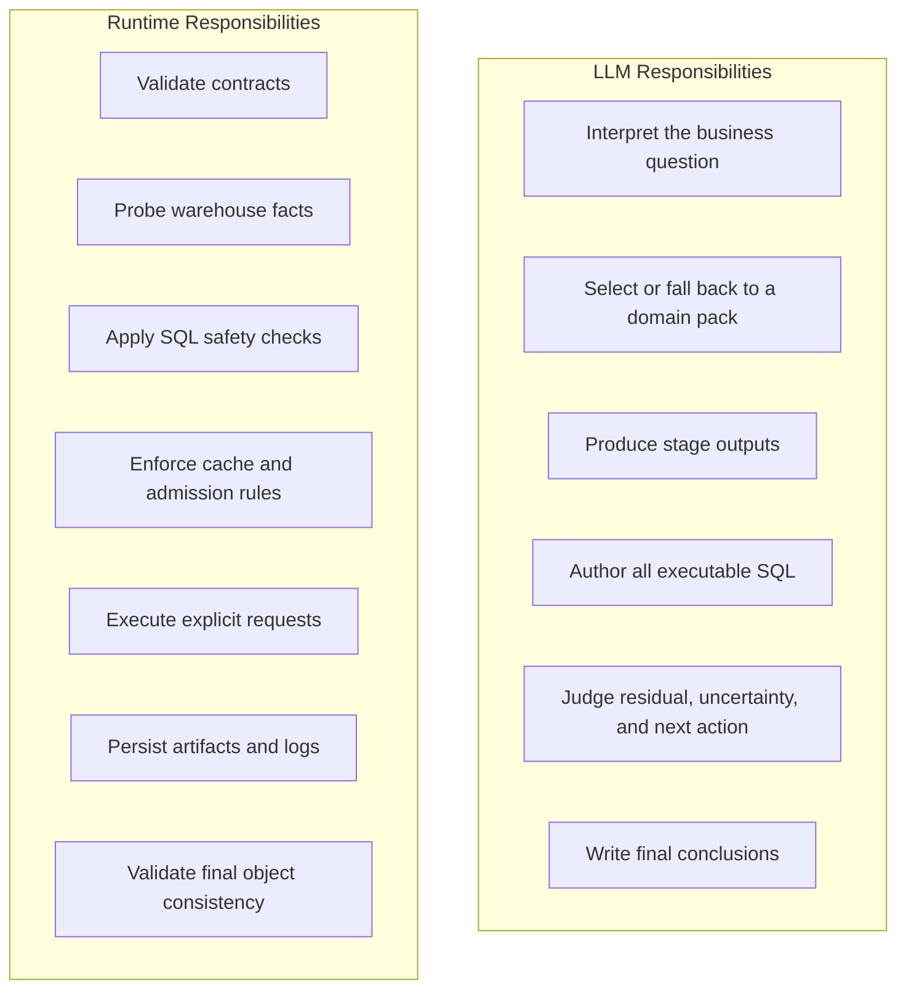
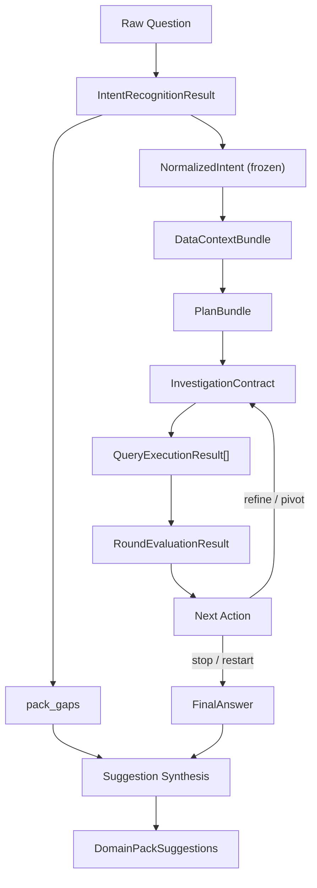

# Deep Research Skill Family

This repository implements a contract-first deep research system for business
analysis. Its purpose is not to "let an LLM ask a few SQL questions". Its
purpose is to make a multi-round investigation legible, bounded, auditable, and
recoverable.

The central design choice is simple:

- the `LLM` owns semantic judgment
- the `runtime` owns execution discipline
- shared contracts define the only legal handoff surface between stages

That separation is what turns the skill from an ad hoc analysis script into a
research mechanism.

---

## Why This Design Exists

Most analytical agents fail for one of three reasons:

1. they mix interpretation and execution until nobody can tell where a mistake was introduced
2. they let discovery, planning, execution, and conclusion blur into one loop
3. they produce plausible narratives without a stable evidence chain

This repository is designed to prevent exactly that.

The deep research loop is therefore built around five mechanism-level
constraints:

- `Intent is frozen early`: Stage 1 produces `NormalizedIntent`, and downstream stages must work from that fixed frame.
- `Discovery is discovery-only`: Stage 2 can inspect the warehouse environment, but it cannot quietly "prove" the business conclusion.
- `Execution is contract-bound`: Stage 4 runs only explicit `InvestigationContract.queries[]`.
- `Evaluation is evidence-bound`: Stage 5 evaluates only persisted query outcomes, not imagined evidence.
- `Learning is post-session`: domain pack suggestions happen after the investigation and cannot rewrite the active session.

These constraints are the core of the deep research design. Everything else in
the repo exists to enforce or consume them.

---

## System View

```mermaid
flowchart LR
    U["User Question"] --> S1["Stage 1<br/>Intent Recognition"]
    S1 --> I["IntentRecognitionResult<br/>NormalizedIntent + pack_gaps"]
    I --> S2["Stage 2<br/>Data Discovery"]
    S2 --> D["DataContextBundle"]
    D --> S3["Stage 3<br/>Hypothesis Engine"]
    S3 --> P["PlanBundle<br/>Hypothesis Board + Round 1 Contract"]
    P --> S4["Stage 4<br/>Execution"]
    S4 --> Q["QueryExecutionResult[]"]
    Q --> S5["Stage 5<br/>Investigation Evaluator"]
    S5 --> E["RoundEvaluationResult"]
    E --> L{"Continue?"}
    L -- "refine / pivot" --> S4
    L -- "stop / restart" --> S6["Stage 6<br/>Persistence + Final Answer"]
    S6 --> F["FinalAnswer"]
    F --> S7["Stage 7<br/>Domain Pack Suggestion Synthesis"]
    S7 --> G["DomainPackSuggestions<br/>(best effort)"]
```



Read the flow as a control system rather than a feature list:

- Stages `1-3` define the research frame.
- Stage `4` is the only execution surface.
- Stage `5` decides whether the current evidence justifies another round.
- Stages `6-7` persist the outcome and synthesize future configuration
  improvements.

The serial order is mandatory. Stages must not be skipped or reordered.

---

## Responsibility Boundary



The runtime is intentionally narrow. It does not infer joins, rewrite SQL,
promote hypotheses, or decide whether an explanation is good enough. That work
belongs to the LLM. In return, the LLM does not get to bypass execution safety,
artifact persistence, or contract validation.

This is the main anti-coupling decision in the system.

---

## End-to-End Skill Flow

| Stage | Owner | Primary Input | Primary Output | Why It Exists | Depends On |
| --- | --- | --- | --- | --- | --- |
| 1. Intent Recognition | LLM | raw question, current date, domain packs | `IntentRecognitionResult` | convert a vague request into a frozen research frame | domain pack lexicon, time anchoring |
| 2. Data Discovery | LLM + runtime facts | `NormalizedIntent` | `DataContextBundle` | discover what the warehouse can safely support | runtime probes, active pack unsupported-dimension hints |
| 3. Hypothesis Engine | LLM | `NormalizedIntent`, `DataContextBundle`, active pack | `PlanBundle` | translate the question into falsifiable hypotheses and an executable Round 1 contract | methodology, schema feasibility, pack priors |
| 4. Execution | runtime | `InvestigationContract` | `QueryExecutionResult[]` | run only explicit contract queries under safety and admission constraints | authored SQL, cache policy, warehouse state |
| 5. Investigation Evaluator | LLM | contract, query results, hypothesis board, prior residual state | `RoundEvaluationResult` | update belief state and decide refine, pivot, stop, or restart | actual evidence only |
| 6. Persistence + Final Answer | runtime validates, LLM authors | full session evidence | `FinalAnswer` and persisted artifacts | preserve the evidence chain and close the session | round bundles, latest evaluation |
| 7. Domain Pack Suggestion Synthesis | LLM + runtime persistence | session gaps and final outputs | `DomainPackSuggestions` | convert repeated gaps into future pack improvements without mutating the live session | `pack_gaps`, generic-pack usage, final answer |

---

## Stage-by-Stage Design

### Stage 1: Intent Recognition

Entry doc: [skills/intent-recognition/SKILL.md](skills/intent-recognition/SKILL.md)

This stage exists to freeze the analytical frame before any schema reasoning
starts.

It produces:

- `normalized_intent`
- `pack_gaps`

It is responsible for:

- selecting the active domain pack, unless forced
- classifying `question_style`
- scoring canonical `problem_type`
- normalizing business object, metric, dimensions, filters, and time scope
- deciding whether clarification is required before the rest of the system can proceed

Why it matters:

- If intent remains fluid, every downstream stage can quietly reinterpret the question.
- By freezing `NormalizedIntent`, later failures become attributable: either the question was framed wrong, or downstream stages executed poorly.

Hard dependency:

- Stage 2 may begin only after `NormalizedIntent` is complete.

---

### Stage 2: Data Discovery

Entry doc: [skills/data-discovery/SKILL.md](skills/data-discovery/SKILL.md)

This stage converts warehouse facts into a usable analytical environment model.

It produces:

- `environment_scan`
- `schema_map`
- `metric_mapping`
- `time_fields`
- `dimension_fields`
- `supported_dimension_capabilities`
- `joinability`
- `comparison_feasibility`
- `quality_report`

This stage is intentionally restricted:

- it can inspect tables, headers, samples, cache facts, and load state
- it can interpret those facts into semantic mappings
- it cannot verify the business headline
- it cannot compute driver deltas
- it cannot emit executable investigation results

Why it matters:

- A research system needs a clean separation between "what data exists" and "what the data proves".
- That separation prevents discovery from smuggling conclusions into planning.

Hard dependencies:

- depends on frozen `NormalizedIntent`
- feeds all feasibility judgments for Stage 3

---

### Stage 3: Hypothesis Engine

Entry doc: [skills/deep-research/sub-skills/hypothesis-engine.md](skills/deep-research/sub-skills/hypothesis-engine.md)

This is where the deep research mechanism becomes operational.

It produces:

- `hypothesis_board`
- `round_1_contract`
- `planning_notes`
- `max_rounds`

Its design role is to transform a static environment description into a bounded
investigation plan.

Mechanically, it does three things:

1. generate candidate hypotheses across the five analysis layers from the core methodology
2. filter them through actual schema feasibility from `DataContextBundle`
3. compress the initial search into one executable Round 1 `InvestigationContract`

Round 1 is always audit-first. That rule exists because an expensive driver hunt
is meaningless if the headline metric, scope, or business object is wrong.

Hard dependencies:

- depends on the Stage 1 frame and Stage 2 feasibility map
- produces the only legal execution contract for Stage 4

---

### Stage 4: Execution

Primary runtime surface:

- [runtime/tools.py](runtime/tools.py)
- [runtime/orchestration.py](runtime/orchestration.py)

This stage is the only place where SQL actually runs.

The executable object is `QueryExecutionRequest`, embedded inside
`InvestigationContract.queries[]`.

Runtime guarantees:

- validates required fields before execution
- enforces single-statement safety
- optionally applies a safe-table whitelist
- enforces `cache_policy = bypass | allow_read | require_read`
- respects warehouse admission constraints
- records execution metadata to `execution_log.json`

Runtime does not:

- fill in missing joins
- replace semantic placeholders with SQL
- infer a better query than the authored one

Why it matters:

- Deep research remains explainable only if execution is deterministic with
  respect to the authored contract.
- Once runtime starts improvising SQL semantics, evidence provenance breaks.

Hard dependencies:

- depends on the exact Stage 3 contract
- feeds Stage 5 with observed, not reconstructed, evidence

---

### Stage 5: Investigation Evaluator

Entry doc: [skills/deep-research/sub-skills/investigation-evaluator.md](skills/deep-research/sub-skills/investigation-evaluator.md)

This stage decides whether the session learned enough to continue, pivot, stop,
or restart.

It produces:

- `hypothesis_updates`
- `residual_update`
- `residual_score`
- `residual_band`
- `open_questions`
- `recommended_next_action`
- `conclusion_state`

The evaluator is not just a scorer. It is the control policy of the research
loop.

Its mechanism is built around:

- hypothesis lifecycle updates
- residual logic
- contradiction handling
- stop / pivot / restart policy

Why residual exists:

- Arithmetic explanation is not enough.
- A session can explain part of a movement numerically and still be weak because
  key rival explanations remain alive.
- `residual_score` keeps both explanatory gap and uncertainty visible.

Hard dependencies:

- depends on actual `QueryExecutionResult[]`
- decides whether another contract should exist at all

---

### Stage 6: Persistence and Final Answer

Primary runtime surface:

- [runtime/persistence.py](runtime/persistence.py)
- [runtime/final_answer.py](runtime/final_answer.py)
- [runtime/evaluation.py](runtime/evaluation.py)

This stage closes the session as an evidence package, not just a chat response.

Persisted layout:

```text
RESEARCH/<slug>/
  intent.json
  intent_sidecar.json
  environment_scan.json
  plan.json
  rounds/
    <round_id>.json
  execution_log.json
  final_answer.json
  domain_pack_suggestions.json
  manifest.json
```

Why this matters:

- each file corresponds to an explicit contract object or runtime fact
- the session can be audited or reloaded without hidden in-memory state
- upper layers can use `load_session_evidence(slug)` instead of ad hoc glue

The final answer is therefore a persisted artifact backed by prior stages, not a
free-form summary detached from execution history.

---

### Stage 7: Domain Pack Suggestion Synthesis

Primary docs and runtime:

- [skills/deep-research/domain-packs/DOMAIN_PACK_GUIDE.md](skills/deep-research/domain-packs/DOMAIN_PACK_GUIDE.md)
- [runtime/domain_packs.py](runtime/domain_packs.py)
- [runtime/domain_pack_suggestions.py](runtime/domain_pack_suggestions.py)

This stage converts session friction into future configuration improvements.

It may suggest:

- metric aliases
- dimension aliases
- business aliases
- unsupported dimension hints
- performance risks
- driver family templates
- domain priors
- operator preferences

Why it runs after the final answer:

- the current session must remain stable
- research-time gaps are useful learning signals
- those signals should improve future pack quality without contaminating active conclusions

This is best-effort only. It must not block the user-facing answer.

---

## Deep Research as a Dependency Graph



The key dependency edges are:

- `NormalizedIntent` is upstream of all semantic planning.
- `DataContextBundle` is upstream of all feasibility decisions.
- `InvestigationContract` is upstream of all legal execution.
- `QueryExecutionResult[]` is upstream of all residual and conclusion updates.
- `pack_gaps` is downstream of Stage 1 but only consumed after the session ends.

This is what gives the system traceability. Every conclusion can be walked
backward to the stage object that justified it.

---

## Core Objects

The single contract source is
[skills/deep-research/references/contracts.md](skills/deep-research/references/contracts.md).

The main cross-stage objects are:

- `IntentRecognitionResult`
- `NormalizedIntent`
- `PackGap`
- `DataContextBundle`
- `HypothesisBoardItem`
- `QueryExecutionRequest`
- `InvestigationContract`
- `PlanBundle`
- `QueryExecutionResult`
- `RoundEvaluationResult`
- `FinalAnswer`
- `DomainPackSuggestions`

If a stage document conflicts with the shared schema, `contracts.md` wins.

---

## Core Methodology

The research loop uses the five-layer method defined in
[skills/deep-research/references/core-methodology.md](skills/deep-research/references/core-methodology.md):

1. Audit
2. Demand
3. Value
4. Structure
5. Fulfillment

This is not just an explanatory framework. It shapes operator choice, residual
discipline, stop policy, and restart policy.

Two mechanism choices are especially important:

- `Round 1 is always audit-first`
- `Structure-only evidence should rarely close residual by itself`

Those rules prevent the system from over-trusting attractive but shallow
segment stories.

---

## Domain Packs

Domain packs are the only company-specific configuration layer in the system.

They tune:

- vocabulary mapping
- problem-type hints
- unsupported dimension hints
- performance risk hints
- driver family priors
- operator preferences

They do not replace:

- shared contracts
- the five-layer methodology
- the requirement that all executable SQL must be fully authored by the LLM

For new business contexts, target pack ids are resolved with the deterministic
slug rule implemented in [runtime/domain_packs.py](runtime/domain_packs.py).

---

## Runtime Entry Points

The most important runtime functions are:

- `execute_query_request()` in [runtime/tools.py](runtime/tools.py)
- `execute_investigation_contract()` in [runtime/orchestration.py](runtime/orchestration.py)
- `execute_round_and_persist()` in [runtime/orchestration.py](runtime/orchestration.py)
- `finalize_session()` in [runtime/orchestration.py](runtime/orchestration.py)
- `persist_round_bundle()` in [runtime/persistence.py](runtime/persistence.py)
- `load_session_evidence()` in [runtime/persistence.py](runtime/persistence.py)

Together, these functions form the runtime half of the contract loop:

`contract -> execution -> log -> round bundle -> final answer`

---

## Validation Status

Contract closure is backed by tests in
[tests/test_runtime_contracts.py](tests/test_runtime_contracts.py).

Covered behaviors include:

- `QueryExecutionRequest -> QueryExecutionResult` shape
- cache policy three-state behavior
- execution log persistence
- round bundle persistence
- blocked-runtime precondition checks
- final-answer consistency checks
- investigation-contract execution handoff
- deterministic domain pack target id resolution
- schema-probe quoting safety

---

## Non-Negotiable Rules

1. The runtime returns facts, validates contracts, and executes explicit requests. It does not infer missing semantics.
2. The LLM authors all executable SQL.
3. `NormalizedIntent` is frozen after Stage 1.
4. Stage 2 is discovery-only.
5. Round 1 is audit-first.
6. Every supported final claim must trace to concrete query evidence.
7. Contradictions must stay explicit.
8. `blocked_runtime` is reserved for sessions where runtime blocking prevented all usable evidence.
