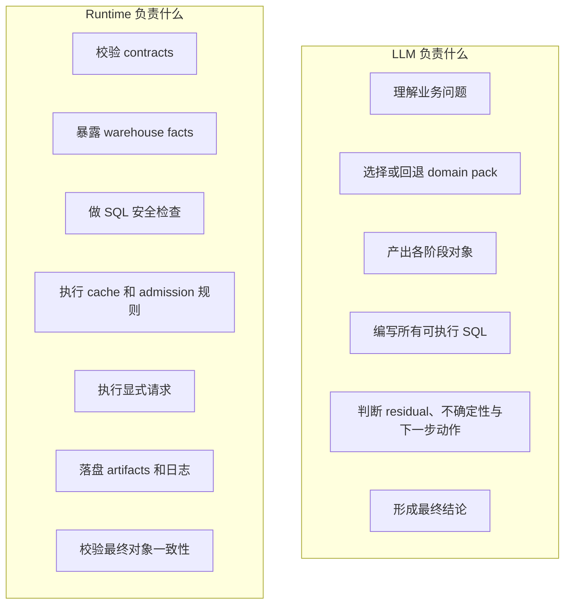
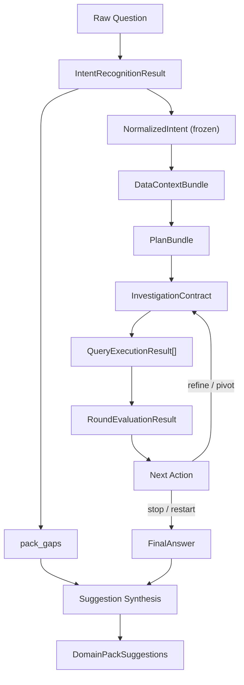

# Deep Research Skill Family

这个仓库实现的不是“让 LLM 随便跑几条 SQL”的分析脚本，而是一套以
contract 为中心的 deep research 研究系统。它的目标是把多轮业务分析变成
一个可约束、可追溯、可审计、可复盘的机制。

这套设计的核心只有三条：

- `LLM` 负责语义判断
- `runtime` 负责执行纪律
- 共享 contract 负责定义阶段之间唯一合法的 handoff 形式

也正因为这三条边界足够硬，这个 skill 才不是一个“会分析”的 prompt，而是
一个“能稳定做研究”的系统。

---

## 为什么要这样设计

大多数分析型 agent 失败，通常不是因为不会写 SQL，而是因为下面三件事混在一起了：

1. 语义解释和执行动作缠在一起，出了错无法定位责任
2. discovery、planning、execution、conclusion 混成一个模糊循环
3. 最终结论看起来合理，但没有稳定的证据链

这个仓库的 deep research 机制，就是为了解决这三类问题。

因此，它被设计成五条不可随意打破的机制约束：

- `意图先冻结`：Stage 1 产出 `NormalizedIntent`，后续阶段必须围绕这个冻结后的问题框架工作
- `发现只负责发现`：Stage 2 可以理解环境，但不能偷偷完成结论验证
- `执行必须走合同`：Stage 4 只能执行显式 `InvestigationContract.queries[]`
- `评估只能吃证据`：Stage 5 只能根据已持久化的执行结果更新判断
- `学习必须后置`：domain pack suggestion 只能在会话结束后做，不能反向污染当前会话

这五条约束就是整个 deep research 的机制设计主轴。仓库里的 skill、runtime、
persistence、tests，都是围绕它展开的。

---

## 全局架构图

```mermaid
flowchart LR
    U["用户问题"] --> S1["Stage 1<br/>Intent Recognition"]
    S1 --> I["IntentRecognitionResult<br/>NormalizedIntent + pack_gaps"]
    I --> S2["Stage 2<br/>Data Discovery"]
    S2 --> D["DataContextBundle"]
    D --> S3["Stage 3<br/>Hypothesis Engine"]
    S3 --> P["PlanBundle<br/>假设板 + Round 1 Contract"]
    P --> S4["Stage 4<br/>Execution"]
    S4 --> Q["QueryExecutionResult[]"]
    Q --> S5["Stage 5<br/>Investigation Evaluator"]
    S5 --> E["RoundEvaluationResult"]
    E --> L{"是否继续?"}
    L -- "refine / pivot" --> S4
    L -- "stop / restart" --> S6["Stage 6<br/>Persistence + Final Answer"]
    S6 --> F["FinalAnswer"]
    F --> S7["Stage 7<br/>Domain Pack Suggestion Synthesis"]
    S7 --> G["DomainPackSuggestions<br/>(best effort)"]
```



这个图不能只按“流程图”来读，更应该按“控制系统”来读：

- `Stage 1-3` 用来建立研究框架
- `Stage 4` 是唯一合法的执行面
- `Stage 5` 是研究回路的控制器，决定继续、转向、停止还是重启
- `Stage 6-7` 负责把研究结果沉淀为证据包，并把本次会话的缺口转化为未来可复用的配置改进

阶段顺序是强约束，不能跳过，也不能重排。

---

## 职责边界图



这条边界是整套机制最关键的设计点：

- runtime 不推断 join，不补 filter，不生成更“聪明”的 SQL，也不替 LLM 做研究判断
- LLM 不绕过执行安全、不绕过持久化纪律，也不能把模糊语义直接塞给 runtime 让它帮忙补全

这意味着每个阶段都能被单独解释，也能单独追责。

---

## 整体 Skill 流程总览

| Stage | Owner | 主要输入 | 主要输出 | 这一层存在的原因 | 依赖 |
| --- | --- | --- | --- | --- | --- |
| 1. Intent Recognition | LLM | 原始问题、当前日期、domain packs | `IntentRecognitionResult` | 把模糊问题压缩成冻结的研究框架 | pack 词汇、时间锚定 |
| 2. Data Discovery | LLM + runtime facts | `NormalizedIntent` | `DataContextBundle` | 判断环境实际能支持什么分析 | runtime probe、unsupported-dimension hints |
| 3. Hypothesis Engine | LLM | `NormalizedIntent`、`DataContextBundle`、active pack | `PlanBundle` | 把问题转成可证伪假设和可执行的 Round 1 contract | 方法论、schema feasibility、pack priors |
| 4. Execution | runtime | `InvestigationContract` | `QueryExecutionResult[]` | 只在安全和 admission 约束下执行显式查询 | authored SQL、cache policy、warehouse state |
| 5. Investigation Evaluator | LLM | contract、query results、hypothesis board、prior residual | `RoundEvaluationResult` | 更新假设状态并决定继续、转向、停止或重启 | 实际执行证据 |
| 6. Persistence + Final Answer | runtime 校验，LLM 产出 | 全量 session evidence | `FinalAnswer` 与 artifacts | 把结论绑定到稳定证据链上 | round bundles、latest evaluation |
| 7. Domain Pack Suggestion Synthesis | LLM + runtime persistence | session 缺口与最终产物 | `DomainPackSuggestions` | 把会话中的摩擦沉淀成未来 pack 改进 | `pack_gaps`、generic pack 命中、final answer |

---

## 分阶段机制展开

### Stage 1: Intent Recognition

入口文档：[skills/intent-recognition/SKILL.md](skills/intent-recognition/SKILL.md)

这一层的目标不是“分析问题”，而是先把问题变成一个后续所有阶段都能共同依赖的、
冻结的研究框架。

它产出：

- `normalized_intent`
- `pack_gaps`

它负责：

- 选择 active domain pack，或遵从强制指定的 pack
- 识别 `question_style`
- 对 canonical `problem_type` 打分
- 规范化 business object、metric、dimensions、filters、time scope
- 判断是否必须先澄清问题，才能安全进入后续研究

为什么这一层重要：

- 如果问题框架不冻结，后面的 discovery、planning、execution 都可能在悄悄改题
- 一旦 `NormalizedIntent` 固定，后续错误就能被清晰归因：到底是题目框错了，还是后面的执行和推理做错了

硬依赖关系：

- Stage 2 只能在 `NormalizedIntent` 完整后启动

---

### Stage 2: Data Discovery

入口文档：[skills/data-discovery/SKILL.md](skills/data-discovery/SKILL.md)

这一层负责把 runtime 提供的环境事实，解释成一个可供研究规划使用的环境模型。

它产出：

- `environment_scan`
- `schema_map`
- `metric_mapping`
- `time_fields`
- `dimension_fields`
- `supported_dimension_capabilities`
- `joinability`
- `comparison_feasibility`
- `quality_report`

这层被故意限制得很严格：

- 可以看表、看表头、看样例、看 cache facts、看 load state
- 可以把这些事实解释成语义层的 schema understanding
- 不能在这一层验证 headline 结论
- 不能在这一层计算 driver delta
- 不能把 discovery 结果包装成“已经证明了什么”

为什么这一层重要：

- deep research 必须把“环境里有什么”与“环境证明了什么”拆开
- 只有这样，planning 才不会被 discovery 偷偷带节奏

硬依赖关系：

- 依赖冻结后的 `NormalizedIntent`
- 反过来为 Stage 3 提供所有 feasibility 判断依据

---

### Stage 3: Hypothesis Engine

入口文档：[skills/deep-research/sub-skills/hypothesis-engine.md](skills/deep-research/sub-skills/hypothesis-engine.md)

这一层是 deep research 机制从“静态描述”变成“动态研究回路”的关键节点。

它产出：

- `hypothesis_board`
- `round_1_contract`
- `planning_notes`
- `max_rounds`

它的设计职责是：把一个已经被规范化的问题和一个已经被解释过的数据环境，
压缩成一个有边界的研究计划。

它在机制上做三件事：

1. 基于核心方法论生成候选假设
2. 用 `DataContextBundle` 过滤掉不可测或不值得测的路径
3. 生成一个可直接执行的 Round 1 `InvestigationContract`

为什么 Round 1 必须 audit-first：

- 如果 headline metric、本体对象、时间范围本身就错了，后面所有 driver 分析都不成立
- 先审计，再解释，是这套 deep research 机制最重要的质量护栏

硬依赖关系：

- 依赖 Stage 1 的问题框架与 Stage 2 的可行性结果
- 产出 Stage 4 唯一合法的执行合同

---

### Stage 4: Execution

主要 runtime 入口：

- [runtime/tools.py](runtime/tools.py)
- [runtime/orchestration.py](runtime/orchestration.py)

这一层是整个系统里唯一真正执行 SQL 的地方。

可执行对象是 `QueryExecutionRequest`，它只允许出现在
`InvestigationContract.queries[]` 里。

runtime 的保证包括：

- 执行前校验必填字段
- 做单语句安全检查
- 可选应用安全表白名单
- 强制执行 `cache_policy = bypass | allow_read | require_read`
- 遵守 warehouse admission 规则
- 将执行元数据写入 `execution_log.json`

runtime 明确不会做：

- 自动补 join
- 用语义占位符拼 SQL
- 把一个不完整的 query request 自动修成可执行 SQL

为什么这一层重要：

- 只有 execution 对 authored contract 保持确定性，研究结果才可追溯
- 一旦 runtime 开始“帮忙推断 SQL”，证据来源就不再稳定

硬依赖关系：

- 只依赖 Stage 3 给出的显式 contract
- 给 Stage 5 提供观测到的事实，而不是事后重构的“解释性证据”

---

### Stage 5: Investigation Evaluator

入口文档：[skills/deep-research/sub-skills/investigation-evaluator.md](skills/deep-research/sub-skills/investigation-evaluator.md)

这一层决定研究是否值得继续、应该转向、可以停止，还是必须重启。

它产出：

- `hypothesis_updates`
- `residual_update`
- `residual_score`
- `residual_band`
- `open_questions`
- `recommended_next_action`
- `conclusion_state`

它不是一个简单的“打分器”，而是整个研究回路的控制策略。

它的机制建立在四个东西上：

- 假设生命周期更新
- residual logic
- contradiction handling
- stop / pivot / restart policy

为什么 residual 是核心机制：

- 业务分析不能只看“解释了多少”，还要看“还剩多少关键不确定性”
- 一个会话可以在数值上解释一部分现象，但如果主要 rival hypothesis 仍然存活，它就还不能被视为闭合
- `residual_score` 让“解释缺口”和“不确定性缺口”同时可见

硬依赖关系：

- 只能依赖实际 `QueryExecutionResult[]`
- 它决定下一轮 contract 是否还应该存在

---

### Stage 6: Persistence and Final Answer

主要 runtime 入口：

- [runtime/persistence.py](runtime/persistence.py)
- [runtime/final_answer.py](runtime/final_answer.py)
- [runtime/evaluation.py](runtime/evaluation.py)

这一层的目标不是“写个结论”，而是把整场研究沉淀成一个可回放、可加载、可审计的证据包。

持久化目录如下：

```text
RESEARCH/<slug>/
  intent.json
  intent_sidecar.json
  environment_scan.json
  plan.json
  rounds/
    <round_id>.json
  execution_log.json
  final_answer.json
  domain_pack_suggestions.json
  manifest.json
```

这一层的重要性在于：

- 每个文件都对应一个显式 contract 对象或 runtime 事实
- 整个 session 可以脱离对话上下文被重放和审计
- 上层统一通过 `load_session_evidence(slug)` 读取稳定证据，而不是靠隐式内存状态补胶水

所以 `FinalAnswer` 不是“聊天输出的最后一段话”，而是一个被前面 stages 约束过的、
可落盘的研究结论对象。

---

### Stage 7: Domain Pack Suggestion Synthesis

相关文档与 runtime：

- [skills/deep-research/domain-packs/DOMAIN_PACK_GUIDE.md](skills/deep-research/domain-packs/DOMAIN_PACK_GUIDE.md)
- [runtime/domain_packs.py](runtime/domain_packs.py)
- [runtime/domain_pack_suggestions.py](runtime/domain_pack_suggestions.py)

这一层负责把本次会话中的摩擦和缺口，转化成未来 pack 可复用的改进建议。

它可能建议的内容包括：

- metric aliases
- dimension aliases
- business aliases
- unsupported dimension hints
- performance risks
- driver family templates
- domain priors
- operator preferences

为什么它必须放在最终答案之后：

- 当前会话的研究框架必须保持稳定
- 会话中的 gap 是宝贵信号，但不应该反向污染当前结论
- 正确的做法是把 gap 转化成 future pack improvement，而不是 session-time 补配置

这一层是 best-effort，不得阻塞最终回答。

---

## Deep Research 依赖关系图



这个依赖图里最重要的边是：

- `NormalizedIntent` 是所有后续语义规划的上游
- `DataContextBundle` 是所有 feasibility 判断的上游
- `InvestigationContract` 是所有合法执行的上游
- `QueryExecutionResult[]` 是 residual 和 conclusion 更新的上游
- `pack_gaps` 虽然在 Stage 1 生成，但只允许在会话结束后参与 suggestion synthesis

这也是整套系统可追溯的根本原因。任何最终结论，都可以沿着依赖边反查到它到底是由哪个阶段对象支撑的。

---

## 共享对象

全仓库唯一共享 contract 来源是：
[skills/deep-research/references/contracts.md](skills/deep-research/references/contracts.md)

主要跨阶段对象包括：

- `IntentRecognitionResult`
- `NormalizedIntent`
- `PackGap`
- `DataContextBundle`
- `HypothesisBoardItem`
- `QueryExecutionRequest`
- `InvestigationContract`
- `PlanBundle`
- `QueryExecutionResult`
- `RoundEvaluationResult`
- `FinalAnswer`
- `DomainPackSuggestions`

如果某个 stage 文档和共享 schema 冲突，以 `contracts.md` 为准。

---

## 核心方法论

这套研究回路采用
[skills/deep-research/references/core-methodology.md](skills/deep-research/references/core-methodology.md)
中定义的五层分析法：

1. Audit
2. Demand
3. Value
4. Structure
5. Fulfillment

它不是一个“解释框架”而已，而是直接影响：

- operator 选择
- residual discipline
- stop policy
- restart policy

其中两个机制约束尤其关键：

- `Round 1 必须 audit-first`
- `仅靠 structure 证据，通常不应该把 residual 降到足够低`

这两条规则的作用，是防止系统过早沉迷于好看的分群故事，却没有先确认分析本体是否成立。

---

## Domain Pack 的角色

Domain pack 是整个系统里唯一的公司定制化配置层。

它负责调优：

- 词汇映射
- problem type hints
- unsupported dimension hints
- performance risk hints
- hypothesis family priors
- operator preferences

它不会替代：

- 共享 contracts
- 五层方法论
- “所有可执行 SQL 都必须由 LLM 完整编写”这一原则

对于新业务场景，target pack id 通过
[runtime/domain_packs.py](runtime/domain_packs.py)
中的 deterministic slug 规则生成。

---

## Runtime 关键入口

最重要的 runtime 函数包括：

- `execute_query_request()` in [runtime/tools.py](runtime/tools.py)
- `execute_investigation_contract()` in [runtime/orchestration.py](runtime/orchestration.py)
- `execute_round_and_persist()` in [runtime/orchestration.py](runtime/orchestration.py)
- `finalize_session()` in [runtime/orchestration.py](runtime/orchestration.py)
- `persist_round_bundle()` in [runtime/persistence.py](runtime/persistence.py)
- `load_session_evidence()` in [runtime/persistence.py](runtime/persistence.py)

它们共同构成 runtime 一侧的 contract loop：

`contract -> execution -> log -> round bundle -> final answer`

---

## 验证状态

这套 contract closure 已经有测试覆盖，测试文件位于：
[tests/test_runtime_contracts.py](tests/test_runtime_contracts.py)

当前覆盖的行为包括：

- `QueryExecutionRequest -> QueryExecutionResult` shape
- `cache_policy` 三态行为
- execution log 落盘
- round bundle 落盘
- blocked-runtime 触发前提校验
- final-answer 一致性校验
- investigation-contract 执行 handoff
- deterministic domain pack target id
- schema probe 的 quoting 安全

---

## 不可违反的规则

1. runtime 只返回事实、校验 contracts、执行显式请求，不推断缺失语义。
2. 所有可执行 SQL 都由 LLM 编写。
3. `NormalizedIntent` 在 Stage 1 之后冻结。
4. Stage 2 只做 discovery。
5. Round 1 必须 audit-first。
6. `FinalAnswer` 中每条 supported claim 都必须能回溯到具体查询证据。
7. 矛盾必须显式保留。
8. `blocked_runtime` 只用于 runtime 阻断了全部可用证据的情况。
